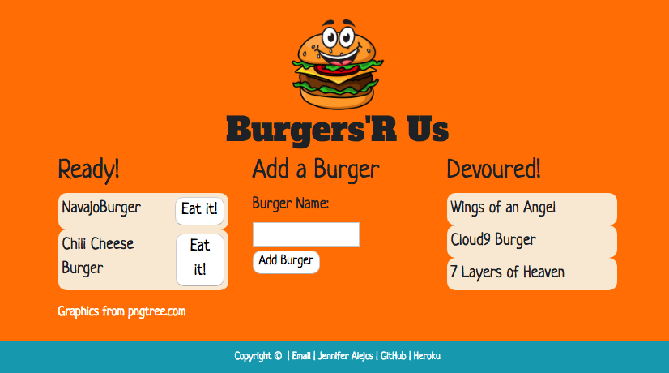

# [Burger Restaurant](https://alejosjen.github.io/BurgerRestaurant/.)

For customers wanting a quick bite to eat, just type in what you want and presto! Your burger is ready to eat, just click to eat it.

The application has front end development with HTML, CSS and JS. Jquery handles the AJAX calls from the server side and Express-Handlebars helps build the HTML.

The backend is using MySQL to store data and Express for routing and running a server connection.

The build structure follows an MVC paradigm (model/view/controller). The views hold the styling and HTML formatting, the controller routes input from the client to the server and vice versa, and the model is managing the data for the views and controller.

[Heroku Link](https://fierce-fortress-58801.herokuapp.com/) needs more work to figure out the connections for database set up with JawsDB.

Jennifer Alejos [Email](alejosjen@gmail.com) & [Website](https://www.jenalejos.com/) & [GitHub Profile](https://github.com/alejosjen)